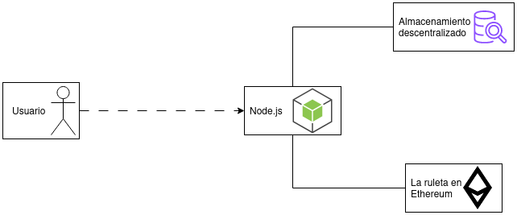

# Ejercicio 2

A continuación se documenta el caso de uso empleado para el desarrollo del ejercicio 2: almacenamiento de resultados de tiradas de la ruleta.

El objetivo principal, a grandes rasgos, es mostrar los 15 últimos resultados de las tiradas de la ruleta. Para ello, se sube un fichero JSON con los 15 últimos resultados a la red de nodos IPFS.

Este caso de uso es una versión simplificada de lo que será un caso de uso del trabajo final, el cual empleará una base de datos descentralizada como _Orbit DB_.

## Instalación del entorno

Para ejecutar correctamente el entorno debe realizarse el siguiente procedimiento:

1. Replicar un entorno similar al del ejercicio 1, es decir, crear una aplicación con Node.js como _dapp_ipfs_, un nodo IPFS con Docker y desplegar un _smart-contract_ con el mismo contenido que _IpfsStorage.sol_. 

    Siguiendo los pasos del enunciado del ejercicio 1 debería ser suficiente.

2. Sustituir el directorio _src_ y sus contenidos por el directorio de igual nombre disponible en esta carpeta del repositorio.

Una vez completado estos pasos, en una terminal situada en el directorio de _dapp_ipfs_, ejecutar:

```bash
npx start
```

Esto desplegará la aplicación con el código desarrollado por nosotros.

## Explicación del caso de uso

Como se comentó previamente, el caso de uso consiste en añadir, en formato JSON, los últimos 15 resultados de la ruleta. La idea sería permitir generar estadísticas para que los usuarios puedan comprobar que la ruleta es fiable y aleatoria, o incluso que puedan decidir a que valor apostar en función de resultados anteriores si así lo consideran. 

El concepto original se concibió para emplear en combinación con _Orbit DB_, framework de base de datos compatible con sistemas de ficheros distribuidos como IPFS. De esta forma, cuando un usuario quisiese acceder a los últimos 15 resultados, el sistema realiza una consulta y recupera los valores requeridos.

No obstante, para esta tarea concreta no se emplea _Orbit DB_, por lo que se seguirá un planteamiento más simple: cada 15 tiradas de la ruleta se subirá un fichero con los resultados. De esta forma, aunque no se actualicen los resultados hasta pasar los 15 turnos, se almacenan los resultados en el sistema de ficheros.



### Actores involucrados

+ Usuario. Es el actor que interactúa con el _front-end_ para obtener los últimos 15 resultados.
+ La ruleta en Ethereum. En la versión ideal de este caso de uso, sería la encargada de enviar los resultados cada 15 tiradas. Sin embargo, por simplicidad para la demostración del sistema, será el propio usuario el que suba dichos resultados interactuando contra el _front-end_.
+ Almacenamiento descentralizado. Compuesto por todos los nodos que almacenan los resultados de la ruleta de forma descentralizada.

### Desarrollo del caso de uso

En primer lugar, el _smart-contract_ (en este caso, La ruleta), subiría los resultados al Node.js en forma de fichero JSON. En este caso, como ya se ha comentado, el usuario será el que suba dichos contenidos interactuando con el _front-end_. 

Una vez subidos, el servidor Node.js analiza el contenido y calcula el hash del archivo. Este se empleará como nombre del mismo. 

A continuación, se establece conexión con el sistema de almacenamiento descentralizado y se sube el contenido. Para recuperar de forma sencilla dicha información, se empleara el contrato _IpfsStorage.sol_ definido para el primer ejercicio, sobre el cual guardaremos el hash de las últimas 15 tiradas de la ruleta. Esto implica una transacción cuyo coste recae sobre la dirección establecida en _src/contracts/src/addresses.json_. Tras completarse dicha operación, los contenidos están disponibles por medio del mapping _userFiles_. 

El siguiente paso será cargar dichos archivos en el _front-end_. Para ello se realizará una petición al mapping _userFiles_ con la dirección guardada en _src/contracts/src/addresses.json_. Esta devolverá el nombre del archivo en IPFS y así se podrá acceder a sus contenidos y, por lo tanto, mostrarlos en la página web.